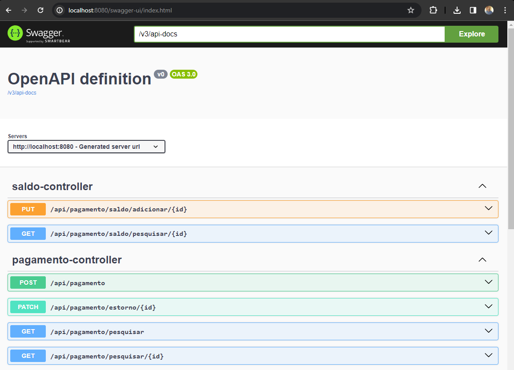
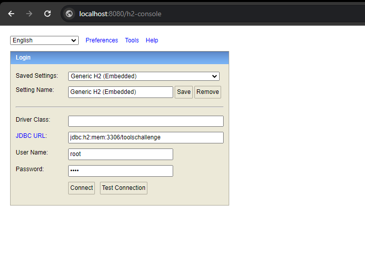
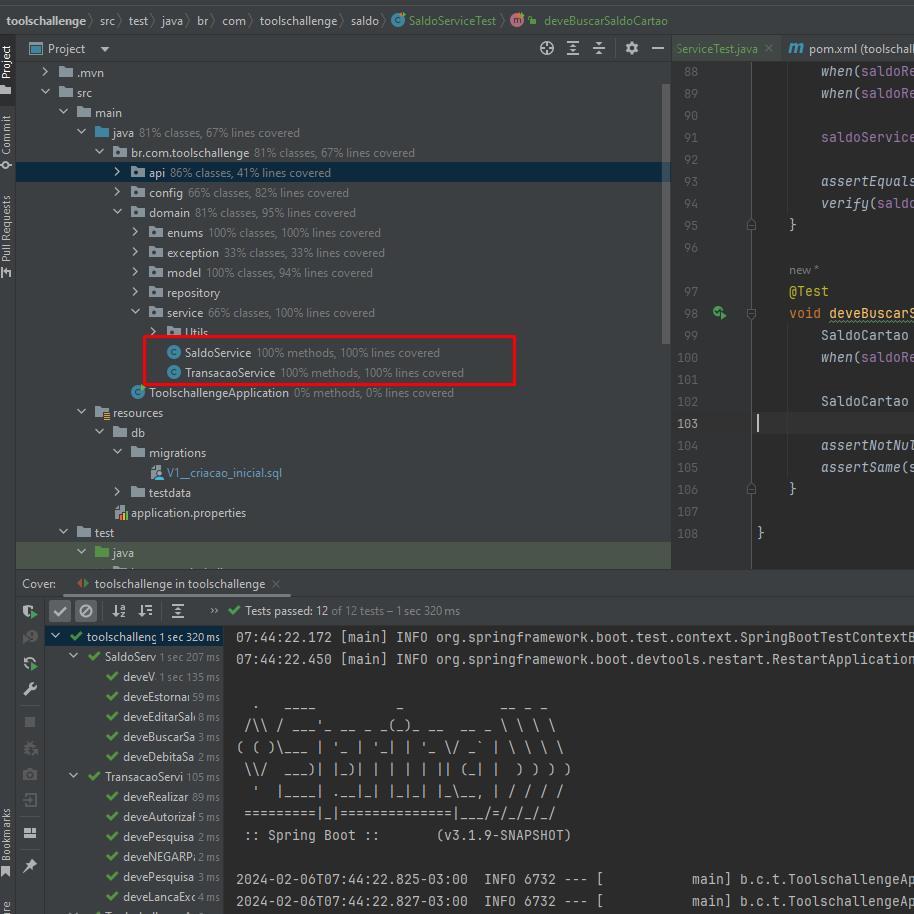

<body>
<h1 style="text-align: center;"> Api pagamentos </h1>

<h2> Technologias utilizadas </h2>
<ul>
<li>Java 17 </li>
<li>Maven 3.9.6 </li>
<li>Springboot 3.1.9 </li>
<li>Hibernate/JPA</li>
<li>H2 database </li>
<li>Flyway </li>
</ul>

<h2> Rodando a aplicação </h2>
<ol>
<li>Gerando o jar da aplicação com o comando "mvn clean package"</li>
<li>Executar projeto "java -jar .\target\toolschallenge-0.0.1-SNAPSHOT.jar"</li>
<li>Ou simplesmente rodar a classe main na IDE IntelliJ</li>
</ol>

<h2> Descrição do Projeto </h2>
<ol>
<li>Realiza pagamentos atravez endpoint do tipo Post.</li>
<li>Realiza estorno de transações executadas atravez do endpoint do tipo Patch.</li>
<li>Realiza consulta de transação especifica pelo id, atravez do endpoint tipo Get.</li>
<li>Realiza consulta de todas transações atravez do endpoint do tipo Get.</li>
<li>Realiza adição de saldo atravez endpoint do tipo Put.</li>
<li>Realiza consulta de saldo atravez endpoint do tipo Get.</li>
<h5>Observação</h5>
Os dados estão sendo salvos em uma base H2. Foi adicionado funcionalidade de adição de saldo para simular transação negada, 
autorizada e também realizar consulta para saber se há saldo antes de realizar pagamento.
</ol>

<h2> Validações Pagamento / Uso </h2>
<ol>
<li>Caso tente realizar pagamento ,a aplicação vai verificar atravez de um saldo fixo adicionado para cartão se há saldo, 
caso não houver saldo suficiente de acordo com valor do pagamento o Status da transação é setado para "Negado" e a transação é salva , e retorna o json com status Negado.
 
Caso houver saldo a transação debita do valor do saldo existente o valor enviado no json de pagamento seta o Status
para Autorizado salva e retorna json com status Autorizado.
</li>
<li>Para realizar estorno é consultado pelo id da transação, caso o sistema encontre uma transação e o status 
esteja como Autorizado, o sistema seta o Status como cancelado realiza o estorno do valor encontrado para o saldo persiste na base e retorna json com status Cancelado. 
 
Caso seja encontrada uma transação pelo id informado e o Status não seja Autorizado o sistema lança uma exceção tratada informando que não é possível
realizar estorno , pois a transação já se encotra com status de CANCELADA ou foi NEGADA.
</li>
</ol>

<h2> Validações Saldo / Uso </h2>
<ol>
<li>Foi disponibilizado endpoint para adicionar Saldo ao saldo já existente, com isso podemos simular de forma melhor as transações, 
foi adicionado limite para adição de saldo "10.000" caso tente adicionar mais o sistema lança exceção dizendo 
"Limite maximo da conta foi excedido." e o valor adicionado sempre soma ao valor existente.
</li>
<h5>Observação</h5>
Assim como em Pagamentos no Saldo existe uma validação ao tentar adicionar valor Negativo o sistema
lança exceção "O valor deve ser um número positivo". 

</ol>

<h2> Documentação Swagger </h2>
 Foi disponibilizado a documentação da api atravez do Swagger no link
<a>http://localhost:8080/swagger-ui/index.html</a> ,basta subir aplicação local.

  

<h2> Observação </h2>
Foi utilizado o Flyway para controle de versão da base de dados , e também inserção de dados 
para testes, foi inserido um script para inserção de 3 transações uma com cada status para caso quiser realizar pesquisas
sem adicionar dados, e também lá contém a inserção do Saldo padrão com valor de 500 reais para no momento em que 
realizar transações já debite do saldo etc. por conta da inserção direto na base apos subir aplicação eu só disponibilizei
endpoints de pesquisa e adição de saldo não cadastro.

Para acessar base dados disponivel no link = <a>http://localhost:8080/h2-console</a>  e inserir as informações JDBC URL: jdbc:h2:mem:3306/toolschallenge, Username:root, Password:root

  

<h2> Cobertura testes service </h2>

  

</body>

